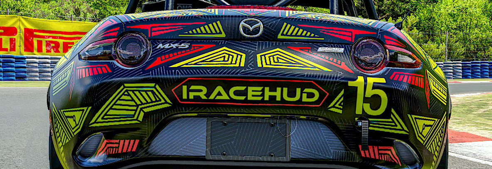

# iRaceHUD

<p align="center"></p>
<p align="center"><a href="https://www.iracing.com/">iRacing</a> HUD overlay built in <a href="https://tauri.app/">Tauri</a></p>

## Installation

You can download latest installer executable from the [releases page](https://github.com/xikxp1/iRaceHUD/releases/latest).

You may be prompted to accept running the application by Microsoft Defender SmartScreen as iRaceHUD installer executables are not signed.

iRaceHUD will update itself automatically on startup if new release is available.

## Development

### Install dependencies

After intial checkout you can run

```
pnpm install
```

to fetch project dependencies. All backend dependecies will be fetched automatically upon running the application.

### Run in development mode

Run iRaceHUD in development mode:

```
pnpm tauri dev
```

### Build application

You can run

```
pnpm tauri build
```

to build production release locally. You'll need to set up signing keys to distribute installer, but generally this is not needed as application is built upon every commit to main branch by corresponding Github action.

### Recommended IDE Setup

[VS Code](https://code.visualstudio.com/) + [Svelte](https://marketplace.visualstudio.com/items?itemName=svelte.svelte-vscode) + [Tauri](https://marketplace.visualstudio.com/items?itemName=tauri-apps.tauri-vscode) + [rust-analyzer](https://marketplace.visualstudio.com/items?itemName=rust-lang.rust-analyzer) + [Tailwindcss](https://marketplace.visualstudio.com/items?itemName=bradlc.vscode-tailwindcss).

### Fetching new track SVG paths

> [!IMPORTANT]
> You should enable iRacing legacy authentication for your account to run the following script. The instructions are available in [official support article](https://support.iracing.com/support/solutions/articles/31000173894-enabling-or-disabling-legacy-read-only-authentication)

Script downloads track maps from iracing API and saves them into a static file. Generally it should be used when new tracks are released.

Set environment variables:

```
$env:IRACING_LOGIN = '<iracing login>'
$env:IRACING_PWD = '<iracing password>'
```

Run script via pnpm:

```
pnpm run fetch-track-info
```

Script will report its progress and final state upon finish.

Track info (with main track paths) will be saved to [track_info.json](./static/track_info_data/track_info.json).

Track start/finish SVGs will be saved to [start_finish](./static/track_info_data/start_finish/) directory

### Track settings

Iracing's SVG start point and direction may differ with start/finish line and track direction. To overcome this issue one can manually fill in [track_settings.json](./static/track_info_data/track_settings.json) static file. It stores a json object where keys are track ids and values have the following format:

```json
{
    "offset": 0.567,
    "direction": -1
}
```

`offset` is a start/finish line offset from SVG starting point (value should be between `0` and `1`), `direction` is `1` if track direction matches SVG path direction and `-1` otherwise.

To search for these values you can use accompanying interface located at `/track_info` url when launching iRaceHUD via Vite development mode.
